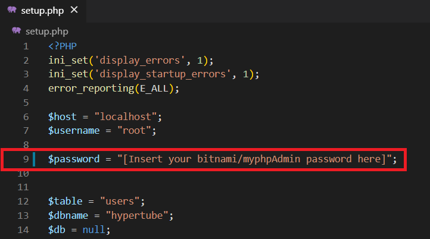
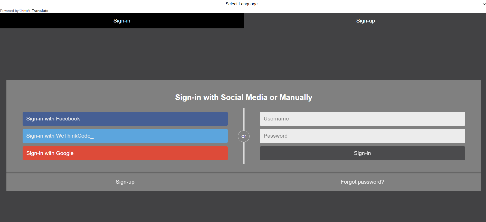
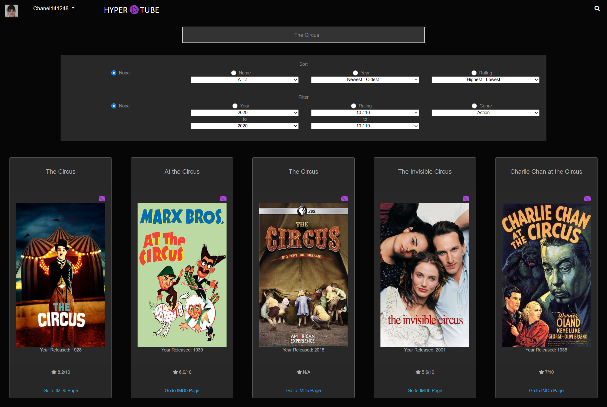
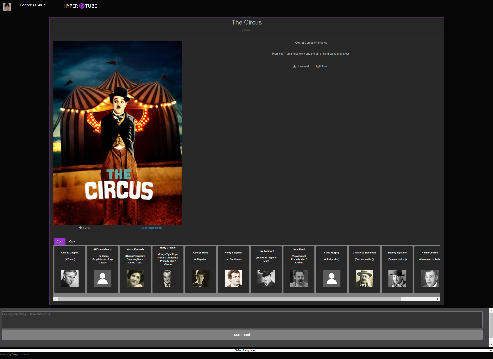
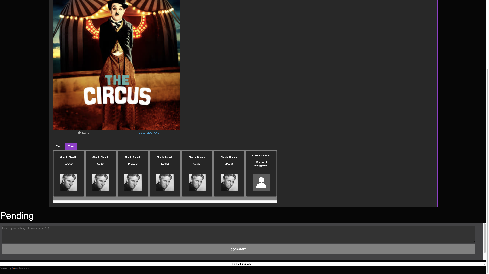
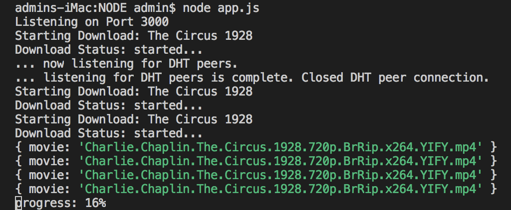

Hypertube is a mock/clone movie streaming site where users can search for movies that they can either stream or download.  

The aim of this project, one of the Web projects from the 42 / WeThinkCode_ curriculum, is to develop a website and demonstrate the learning of the use/implementation of external APIs, oauthentication (external authentication), and torrent protocols. 

> NOTE - The production of this project is purely educational and in no way indorses pirating in any shape or form. 
 
# Installation

## Prerequisites

Hypertube makes use of two servers. 
- An Apache server (in this case an bitnami local server)
- A Node server.

### Apache Server
A local server to host on, in this case we will make use of bitnami local server environments

   - [Bitnami local server environments](https://bitnami.com/stacks/infrastructure)
   
##### MacOS

 - Install [Bitnami MAMP](https://bitnami.com/stack/mamp)

##### Windows

 - Install [Bitnami WAMP](https://bitnami.com/stack/wamp)

##### Linux
> NOTE - this project hasn't been tested on a linux based system

 - Install [Bitnami LAMP](https://bitnami.com/stack/lamp)

### Node Server

- Install [Node](https://nodejs.org/en/) (12.18.3 LTS)

# Clone

Clone this repo to your local machine using:

```
cd [Insert path to your MAMP/ WAMP / LAMP Directory ]/apache2/htdocs
git clone https://github.com/CLetinic/Hypertube.git
```

# Setup
## Configuring Server Environment

### Node Server
Start the Node server

```
cd [Insert path to your MAMP/ WAMP / LAMP Directory ]/apache2/htdocs/Hypertube/NODE
npm install
node app.js
```

### Apache Server
Locate and run the executable file


Configure Server port  
> NOTE - by default the server is set to port 80 we need to change it to 8080  


Start the server


Browse to site location

[http://localhost:8080/Hypertube](http://localhost:8080/Hypertube)

## Configuring Hypertube

### Changing Hypertube Variables 

In [Insert path to your MAMP/ WAMP / LAMP Directory ]/apache2/htdocs/Hypertube/setup.php  

Change the password of `$password`, to the password chosen during the installation of bitnami server - myphpAdmin password.



### Creating Database and Tables

To create database and tables:  
In the browser, navigate to

[http://localhost:8080/Hypertube/setup.php](http://localhost:8080/Hypertube/setup.php )

# Samples | Screenshots
## Sign In | Sign Up 


## Search Page
Search page by default show the most popular movies


User is able to Search, Filter and Sort


Search


## Movie Page
Information | Cast


Crew
> NOTE - Here the stream is buffering to at least 10% - Hence the "Pending" 



This is on the NODE server when the user clicks stream or download. 
> NOTE - Only at 10% and aboce will the stream become available



The movie available to stream


# APIs Used
## Movie APIs
- [TheMovieDB (TMDb)](https://www.themoviedb.org/documentation/api?language=en-US)
- [The Open Movie Database (OMDb)](http://www.omdbapi.com/)

## OAuthentication APIs
- [Facebook](https://developers.facebook.com/docs/facebook-login/web)
- [Google](https://developers.google.com/identity/sign-in/web/sign-in)
- [42 API](https://api.intra.42.fr/apidoc)

# Project Insight
## Project Brief
- [Hypertube Project Brief](./misc/documents/hypertube.en.pdf)
## Project Markingsheet
- [Hypertube Project Marking sheet](./misc/documents/hypertube.markingsheet.pdf)
## Project Trello
- [Hypertube Trello Card](https://trello.com/c/Bq4ta9QG/31-hypertube)
- [Hypertube Trello Board](https://trello.com/b/EL93QDUO/hypertube-wethinkcode)

 
## Project Stack / Technologies
### Front-End
- HTML
- CSS
- Javascript
- [jQuery](https://jquery.com/)
- [Bootstrap](https://getbootstrap.com/)
- [Bootswatch](https://bootswatch.com/) (Bootstrap Theming) - [Cyborg Theme](https://bootswatch.com/cyborg/)

### Back-End
- [PHP](https://www.php.net/)
- [Node](https://nodejs.org/en/)
  
### Databse
- [MySQL](https://www.mysql.com/)
- [phpMyAdmin](https://www.phpmyadmin.net/)
  
## Project File Structure
Granted, it isn't the cleanest file structure....
```
Hypertube
├── Facebook
│   └── ...                                  # OAuthentication - Facebook
├── favicon
│   └── ...
├── GoogleAPI
│   └── ...                                  # OAuthentication - Google
├── images
│   └── ...                                  # Front-End - Images / Assets
├── misc
│   ├── documents
│   │   ├── hypertube.en.pdf                 # Project Brief
│   │   └── hypertube.markingsheet.pdf       # Project Marking Sheet
│   └── images
│       ├── MAMP
│       │   └── ...                          # README - Server Setup Images
│       └── ...                              # README - Project Screen Shots
├── NODE
│   ├── app.js                               # Back-end - Torrent logic - Script to serve with Node
│   └── ...                                  # Back-end - Torrent logic - Uses Node.js
├── user
│   └── commentinfo.php                      # Back-End - User Comments
├── 42-callback.php                          # OAuthentication - 42 | WeThinkCode_
├── config.php                               # OAuthentication - Configuration
├── home.php                                 # Movie Search Page
├── index.php                                # Sign In | OAuthentication
├── setup.php                                # Database - Configuration | Table Creation
├── style.css                                # Front-End - Styling
└── ...                                      # Front-end | Back-end | Configuration | Project core
```

# Authors

- **[Anist Mampuru](https://github.com/anistplenitud)**
- **[Banele Mkhize](https://github.com/BaneleMK)**
- **[Chanel Letinić](https://github.com/CLetinic)**
- **[Lufuno (Lucky) Mbedzi]()**
- **[Pholosho (Dante) Motala](https://github.com/pmotala)**
- **[Simbiso Marwise](https://github.com/smarwise)**
- **[Takalani Madau](https://github.com/tmadau)**
<!-- - **[Sithembile Mabunda]()** -->


